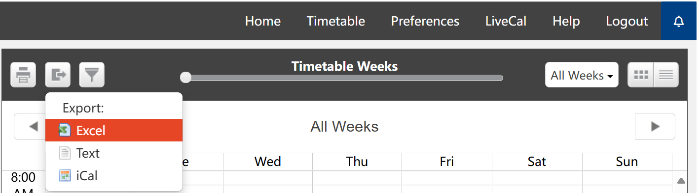
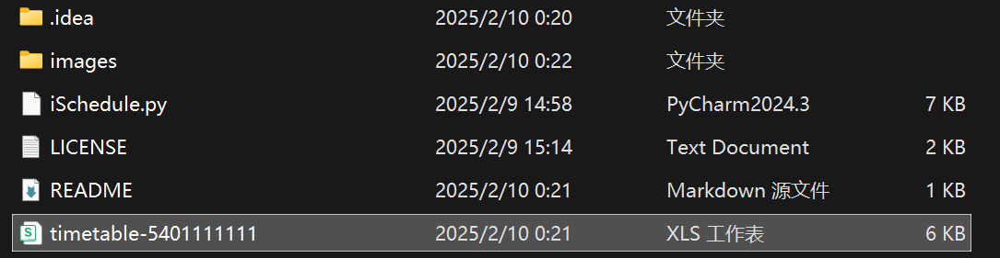
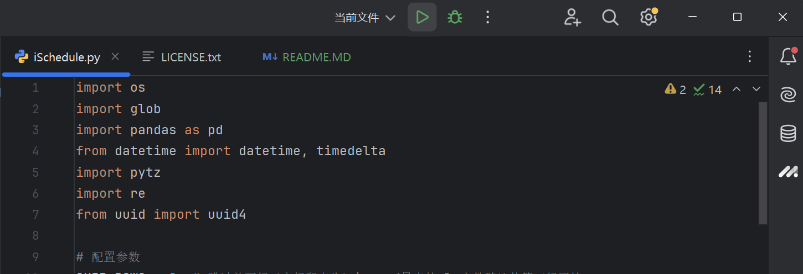
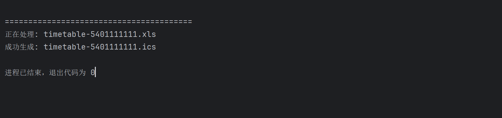
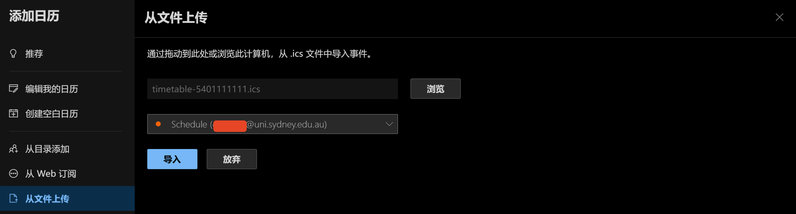

# uniTimetable

> You can find English version below.

📅 **这个小工具可以将 uni 系统中导出的 excel 格式课程表转换成ics格式，以方便导入各种系统的原生日历中。**


## 功能特性

- **自动化转换**：批量处理目录下所有Excel文件（`.xls`/`.xlsx`），生成对应的ICS日历文件。
- **标准化事件**：
  - 自动解析课程时间、持续时间、重复规则（支持跨周重复）。
  - 支持悉尼时区（`Australia/Sydney`），兼容全球日历应用。
  - 自动处理跨年日期（如12月至次年1月）。
- **地址标准化**：
  - 优化教室地址格式（如`Belinda Hutchinson Building` → `ABS Building`）。
  - 支持在线课程标记（`Online`）。
- **容错处理**：跳过无效行并输出错误日志，避免因单条数据问题导致整体失败。

## 快速开始

### 环境要求
- Python 3.6+
- 依赖库：`pandas`, `pytz`, `openpyxl`（用于处理Excel文件）

### 安装依赖
```bash
pip install pandas pytz openpyxl
```
### 使用方法


| Screenshot                 | Doing                                             |
|----------------------------|---------------------------------------------------|
|  | 1. 在 Timetable 页面左上角点击`导出`按钮                      |
|  | 2. 选择 excel 格式导出                                  |
|  | 3. 将下载后的 `timetable-01111111.xls` 文件放到项目根目录       |
|  | 4. 运行 `iSchedule.py`                              |
|  | 5. 生成的`ics`文件会自动保存在根目录下                           |
|  | 6. 把 `ics` 文件导入日历（以 outlook 为例，iOS/iPadOS建议通过邮件添加）|

### 开源协议
本项目采用 MIT 开源协议。欢迎提交 Issue 和 PR~

---

> you can find English version HERE.

📅 This small tool converts the Excel timetable exported from the uni system into the ICS format, making it easy to import into the native calendar apps of various systems.

## Features
- **Automated Conversion**: Batch processes all Excel files (.xls/.xlsx) in the directory and generates corresponding ICS calendar files.

- **Standardized Events**: 
- Automatically parses course times, durations, and recurrence rules (supports weekly repetition).
- Supports the Sydney timezone (Australia/Sydney), compatible with global calendar apps.
- Automatically handles date ranges that span across years (e.g., December to January).

- **Address Standardization**:
- Optimizes classroom address formats (e.g., ABS.Building → Abercrombie Building, Sydney).
- Supports marking online courses (Online).
- **Error Handling**: Skips invalid rows and outputs error logs to prevent failure due to single data issues.


## Quick Start
### Requirements
- Python 3.6+ 
- Dependencies: pandas, pytz, openpyxl (for processing Excel files)

### Install Dependencies
```bash
pip install pandas pytz openpyxl
```
### How to use

| Screenshot                 | Doing                                                                                                          |
|----------------------------|----------------------------------------------------------------------------------------------------------------|
|  | 1. Click the `Export` button on the top-left of the Timetable page.                                            |
|  | 2. Select the `excel` format for export.                                                                         |
|  | 3. Place the downloaded `timetable-01111111.xls` file in the project root directory.                           |
|  | 4. Run `iSchedule.py`.                                                                                         |
|  | 5. The generated `ics` file will be saved in the root directory.                                               |
|  | 6. Import the `ics` file into your calendar (e.g., Outlook; for iOS/iPadOS, it is recommended to add via email). |


### Open Source License
This project is licensed under the MIT License. Feel free to submit Issues and PRs!

⏰ Make timetable management easier!
